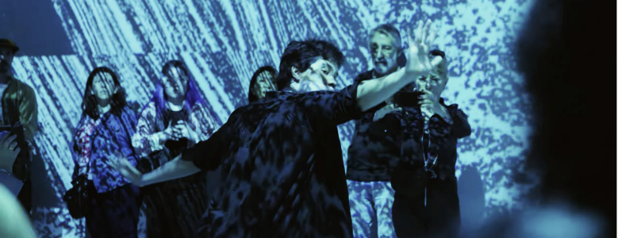
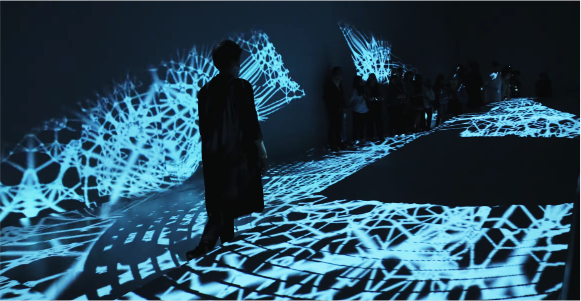

# [AudioStellar](https://audiostellar.xyz/) en la Sala Inmersiva del CCK

Esta pieza se plantea como una continuación al arco de Territorios Sonoros Emergentes, pieza inmersiva con activaciones performativas e interactivas, donde dos seres humanoides se cruzan en la tensión de dominar un cosmos de tecnologías extrañas e inteligencia artificial. Este ciclo de performances reflexiona sobre la tensión entre tecnologías y nuestra simbiosis por medio de buscar perder la forma humana desde el uso de la extensión de los sentidos de lxs performers por medio de sensores acoplados a sus movimientos y un ecosistema audiovisual que reaccionaba a los mismos.

 

`youtube:https://www.youtube.com/watch?v=8wLRq1HJbE8`

 

Visuales: Santiago Fernandez y Ramiro Arsanto.  
Interacción: Santiago Fernandez y Leandro Garber.  
Cuerpxs: Rigel M. Odosky, Matias Perez Azulay y Luca Gomez.  
Sonido: Leandro Garber, Dai Miauro.

---

9 funciones, octubre 2024  
Sala Inmersiva, Centro Cultural Kirchner

