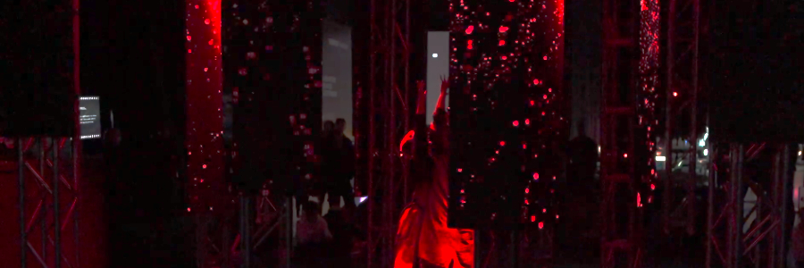
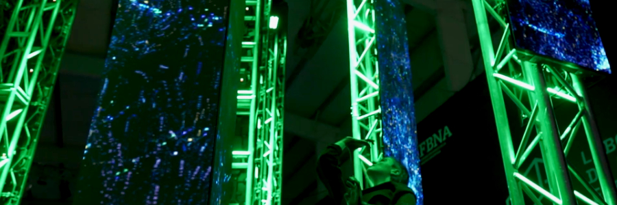
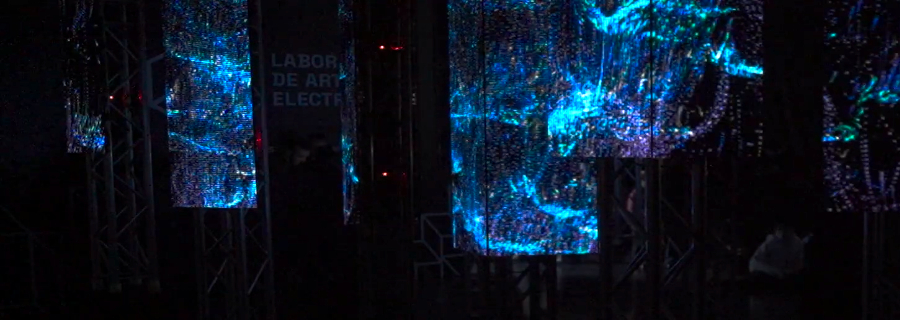
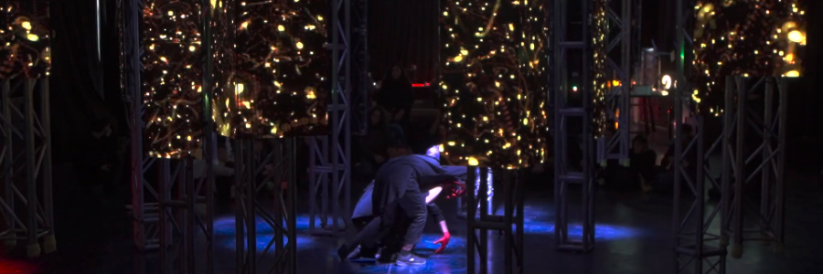

# Territorios Sonoros Emergentes — [AudioStellar](https://audiostellar.xyz/)

Territorios Sonoros Emergentes es una performance de danza y tecnología donde dos seres humanoides y una inteligencia artificial ensayan un rito en un bosque de pantallas de un amanecer distópico tratando de llegar a un equilibrio cósmico.

 

`youtube:https://www.youtube.com/watch?v=SfAuaaqUlG4`

 

Visuales: Santiago Fernandez y Ramiro Arsanto.  
Cuerpxs: Laila Meliz y Luca Gomez.  
Sonido: Leandro Garber, Dai Miauro.

---

26/8/23 Laboratorio de Artes Electrónicas, Tecnópolis

