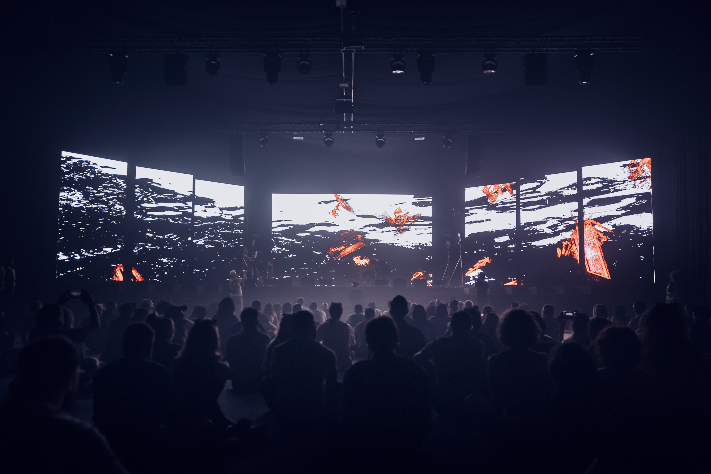
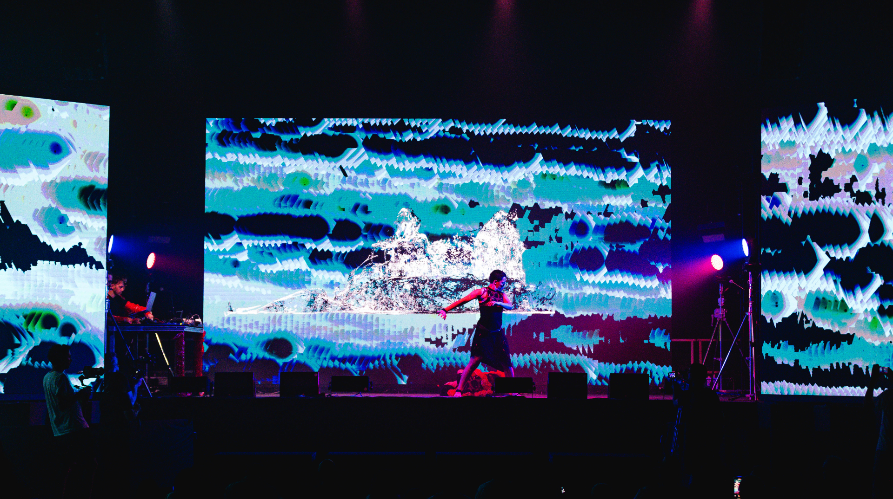
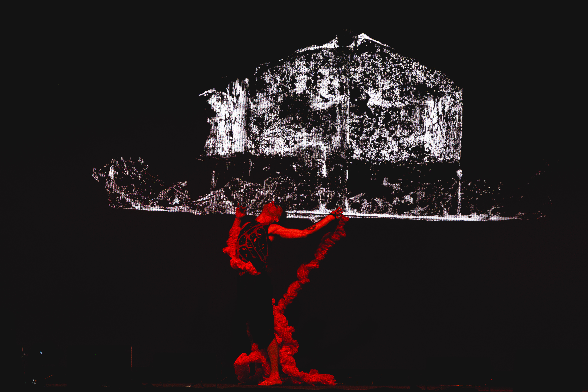
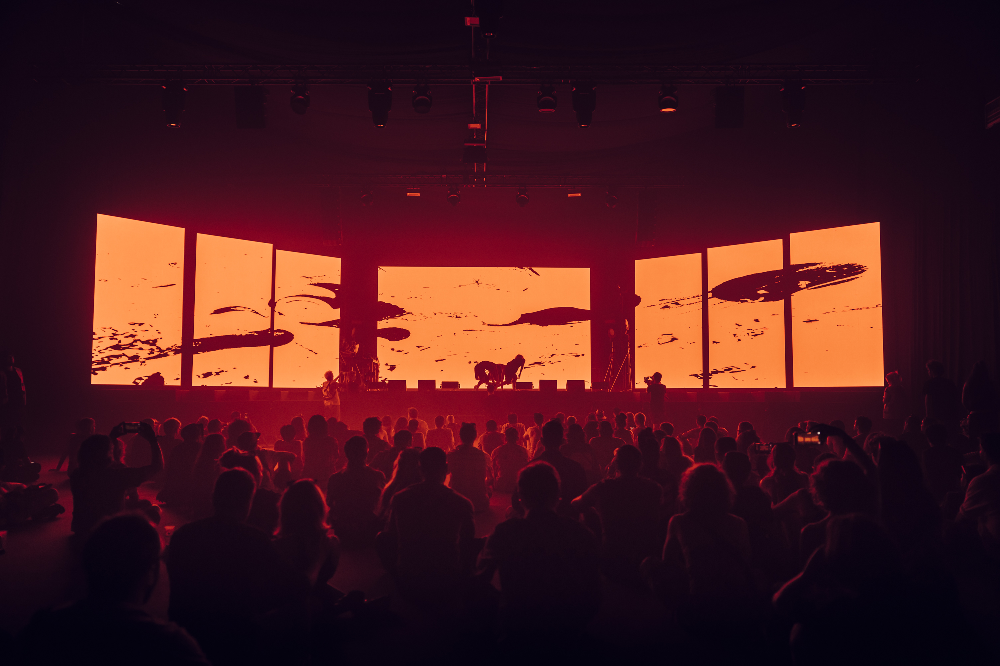

# Trastornos Sonoros Emergentes — [AudioStellar](https://audiostellar.xyz/)

Trastornos Sonoros Emergentes es una conferencia performática del colectivo AudioStellar. La pieza interroga las condiciones de la escucha situada en un mundo atravesado por tecnologías de inteligencia artificial, proponiendo una reflexión encarnada sobre qué significa escuchar y ser escuchado desde el sur global.

En lugar de la conferencia académica tradicional, construye un dispositivo híbrido donde el discurso analítico coexiste con material sonoro y presencia escénica como registros igualmente válidos para formular un problema. La pregunta central es geopolítica y sensorial al mismo tiempo: qué infraestructuras tecnológicas median la escucha contemporánea, quién las diseña y desde qué territorios.

La propuesta transitó por Barcelona, Madrid y Basel en diálogos con comunidades, instituciones musicales, festivales de arte y tecnología de referencia internacional.

 

`youtube:https://www.youtube.com/watch?v=5oz1U27BzsM`

 

Visuales: Santiago Fernandez y Ramiro Arsanto.  
Interacción: Santiago Fernandez y Leandro Garber.  
Guion: Leandro Garber, Rigel M. Odosky y equipo.  
Cuerpxs: Rigel M. Odosky, Matias Perez Azulay y Luca Gomez.  
Sonido: Leandro Garber, Agustin Spinetto.

---

12/06/25 [Sónar+D](https://sonar.es/), Barcelona  
16/06/25 Real Conservatorio Superior de Música, Madrid  
26/06/25 [Kasko](https://www.kasko.ch/), Basel

Fotografías: Roncca y Nerea Coll
