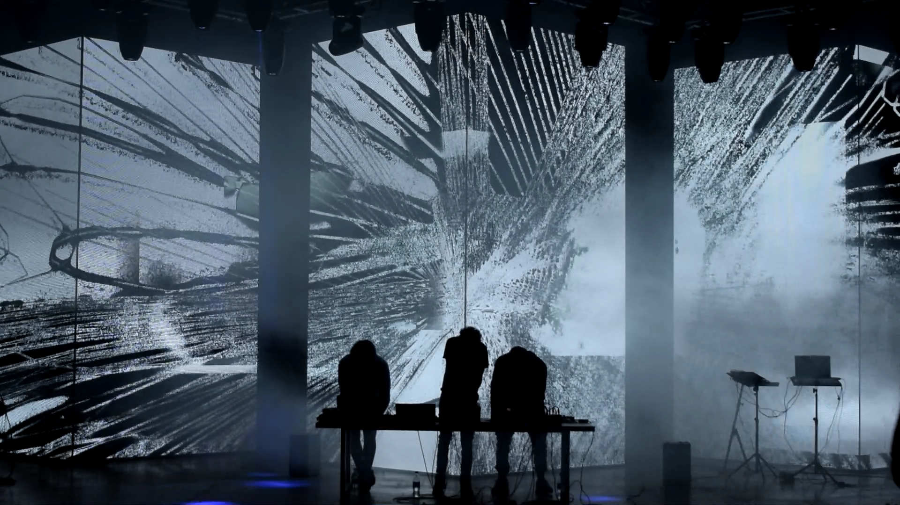
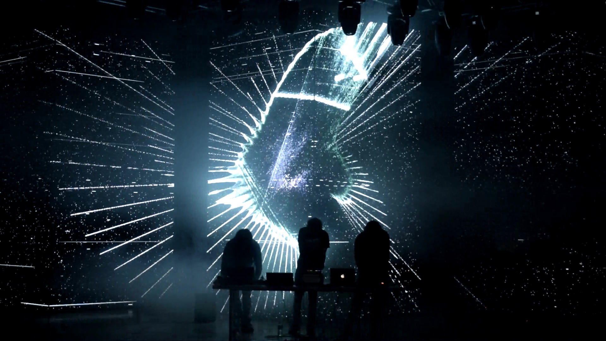
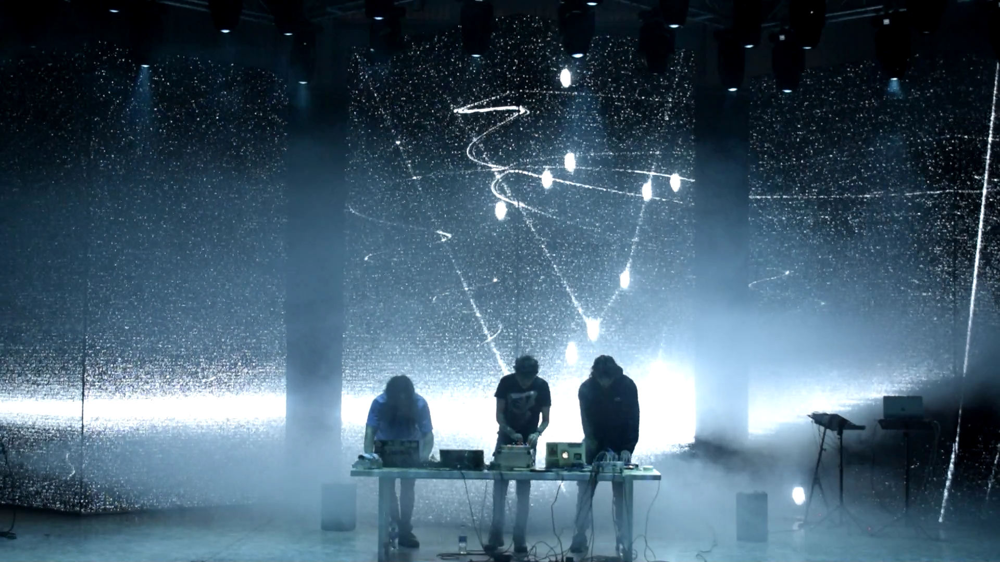

# Improvisaciones en el Espacio Latente — [AudioStellar](https://audiostellar.xyz/)

Improvisaciones en el Espacio Latente es un periplo audiovisual inspirado en una deriva por los pliegues de la inteligencia artificial y sus espacios latentes dentro del microcosmos de AudioStellar, se recorre un paisaje espacial en búsqueda de posibles salidas.

 

`youtube:https://www.youtube.com/watch?v=kZhcpq4R4c0`

 

Visuales: Santiago Fernandez y Ramiro Arsanto.  
Sonido: Leandro Garber, Dai Miauro, Luca Belloti.

---

16/10/22 Laboratorio de Artes Electrónicas, Tecnópolis

